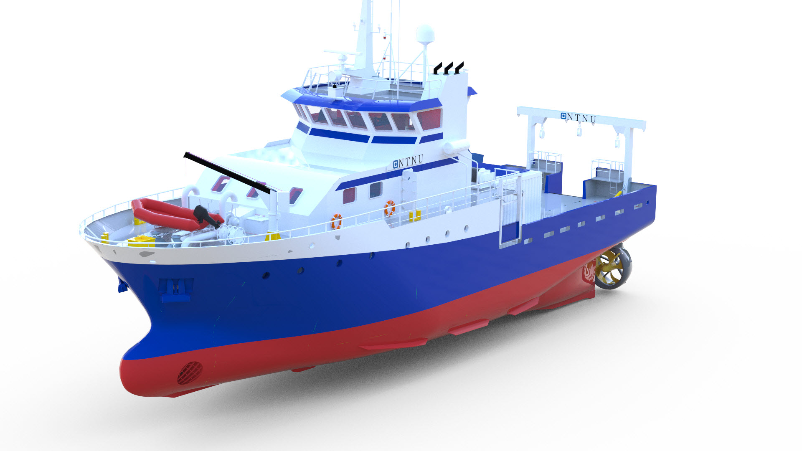

# TMR4240 Project – Python DP Simulator

<p align="center">
  
</p>

Python simulation framework for the project in **TMR4240 Marine Control Systems I** (NTNU, Department of Marine Technology): design, implement, and validate a dynamic positioning (DP) system for NTNU's research vessel **R/V Gunnerus**. The vessel is a 3-DOF (surge, sway, yaw) maneuvering model from the [`mcsimpy`](https://github.com/NTNU-MCS/mcsimpy) toolbox; everything around it — simulation loop, actuators, logging, plotting, automated checks — is provided here. **You implement the DP system.**

The project description (PDF) with all report tasks and mandatory simulations is on Canvas under the *Project* module. This README explains how the repository is organised, how to run it, and how the code maps onto the tasks in that document.

---

## Contents

1. [Quick start](#quick-start)
2. [Repository map](#repository-map)
3. [How the pieces fit together](#how-the-pieces-fit-together)
4. [Array and frame conventions](#array-and-frame-conventions)
5. [What you implement (Part 1)](#what-you-implement-part-1)
6. [Configuration — nothing is hardcoded](#configuration--nothing-is-hardcoded)
7. [Running simulations](#running-simulations)
8. [Automated checks](#automated-checks)
9. [Recommended workflow](#recommended-workflow)
10. [Notebooks](#notebooks)
11. [Plant API for open-loop tests](#plant-api-for-open-loop-tests)
12. [Common pitfalls](#common-pitfalls)
13. [Credits](#credits)

---

## Quick start

Requirements: **Python ≥ 3.10** and **Git** (pip fetches `mcsimpy` from GitHub).

```bash
git clone <repository-url>
cd TMR4240_LAB

python3 -m venv .venv
source .venv/bin/activate        # Windows: .venv\Scripts\Activate.ps1

pip install -e .                 # numpy, scipy, matplotlib, mcsimpy, Jupyter, pytest
python run_case_part1.py         # runs the (empty) template closed loop and plots
python check.py --fast           # every subsystem reports NOT IMPLEMENTED — as expected
```

The editable install (`-e`) means your edits take effect immediately, no reinstall needed. If all three commands run, your environment is ready.

---

## Repository map

```text
run_case_part1.py        Part 1 scenario runner — the file you edit and run
check.py                 Automated checks: python check.py [--fast]

part_1/                  YOUR Part 1 implementation
  config.py                all tunable parameters (SimConfig, RefAxisConfig, thruster layout, your dataclasses)
  current.py               ocean current model                → template
  wind.py                  wind load model                    → template
  controller.py            DP controller                      → template
  reference.py             set-point reference model          → template
  thrust_allocation.py     thrust allocation                  → template


models/                  Provided: Gunnerus 3-DOF vessel wrapper, thruster dynamics
simulation/              Provided: simulator engines, plant API, utilities, plotting, checks
  simulation_part_1.py     DPSimulator3DOF — the Part 1 closed loop
  plant.py                 GunnerusPlant3DOF — open-loop plant API
  utils.py                 Rz(psi), angle wrapping, 3-DOF <-> 6-DOF helpers
  plotter.py               plot_dashboard, plot_time_histories, plot_xy, plot_thrusters, plot_wrench, ...
  checks.py                the check definitions behind check.py / pytest

data/wind_coeff.csv      Gunnerus wind coefficient table C(alpha_rw)
notebooks/               Teaching and verification notebooks (see below)
tests/                   pytest wrappers around simulation/checks.py (run by CI)
```

`models/` and `simulation/` are the provided infrastructure. You may modify them if your design requires it — but document every such change in your report.

---

## How the pieces fit together

One time step of `DPSimulator3DOF.run()` is exactly the signal chain the project text asks you to draw and explain in the *DP System Architecture* section:

```text
 setpoint eta_cmd (NED)
        │
        ▼
 ReferenceModel.step()         smooth eta_ref, nu_ref, acc_ref        (NED)      part_1/reference.py
        │
        ▼
 DPController.compute()        desired wrench tau_d                    (BODY)     part_1/controller.py
        │
        ▼
 ThrustAllocator.allocate()    per-thruster (u_cmd, alpha_cmd)                    part_1/thrust_allocation.py
        │
        ▼
 ThrusterSet.step()            applied wrench tau_thr = B(alpha) u     (BODY)     models/thruster_dynamics.py
        │
        ▼
 Wind.step()  ─┐  wind loads tau_w6                                    (BODY)     part_1/wind.py
               ▼
 Gunnerus3DOF.integrate()      tau_total + current (relative velocity)            models/gunnerus_3dof.py
        │                        Current.step() gives nu_c in NED                 part_1/current.py
        ▼
 eta (NED), nu (BODY)  ───────►  fed back to the controller (Part 1 has no observer)
```

Read [`simulation/simulation_part_1.py`](simulation/simulation_part_1.py) once, top to bottom — the loop is commented stage by stage in this order and is deliberately short. The vessel is integrated with **forward Euler** at `dt = 0.05 s` by default; `mcsimpy` does not support multi-stage integrators for this model, and the wrapper rejects any `method` other than `"Euler"`.

---

## Array and frame conventions

Every generalized vector — everywhere in the project — is **6-DOF**, ordered `[surge, sway, heave, roll, pitch, yaw]`:

| Quantity | Layout | Frame |
| --- | --- | --- |
| Position/attitude `eta` | `[N, E, z, phi, theta, psi]` | NED |
| Velocity `nu` | `[u, v, w, p, q, r]` | BODY |
| Loads (`tau_d`, `tau_thr`, wind, waves) | `[Fx, Fy, Fz, Mx, My, Mz]` in N and Nm | BODY |
| Current `nu_c` | `[V_N, V_E, V_D, 0, 0, 0]` in m/s | NED, direction **towards** |

The vessel model is 3-DOF, so only indices **`[0, 1, 5]`** are active — heading is `eta[5]`, yaw rate is `nu[5]`, yaw moment is `tau[5]` — and the other components are zero. Each template docstring tells you exactly which entries to read and which to fill. The reduction to the 3-DOF vessel happens in one place only: `simulation.utils.to_3dof` / `to_6dof`, at the vessel boundary.

Frames follow the project text: NED `x` North, `y` East, `z` down; BODY `x` to the bow, `y` to starboard; heading `psi` clockwise from North. The rotation used throughout is `NED = Rz(psi) @ BODY` (`simulation.utils.Rz`), so `Rz(psi).T` takes NED vectors — position errors, current, wind — into the body frame. Wrap heading differences with `simulation.utils.wrap_angle_pi`.

**Direction conventions.** The engine and the current model use *towards* (the direction the water flows to). The wind template defaults to the meteorological *from* convention ("wind from south" blows northward). Both constructors take a `semantics` argument so you can state the convention explicitly — and you must state it in the report. A 180° mistake here is the single most common DP bug.

---

## What you implement (Part 1)

The five templates in `part_1/` contain placeholder implementations (zero current, zero wind, zero wrench, pass-through reference, zero thrust). Replace the placeholders; keep the interfaces. Each docstring documents its interface in full — this is only the summary:

| Template | The engine calls | Returns |
| --- | --- | --- |
| `current.py` — `Current` | `step(t, dt, eta, nu)` | `nu_c` (6,) NED velocity, *towards* |
| `wind.py` — `Wind` | `step(t, dt, eta, nu)` | `(tau_w6, info)` — (6,) BODY loads + optional log dict |
| `controller.py` — `DPController` | `compute(t, dt, eta, nu, eta_ref, nu_ref, acc_ref)` | `tau_d` (6,) BODY wrench |
| `reference.py` — `ReferenceModel` | `step(t, dt, eta_cmd)` | `(eta_ref, nu_ref, acc_ref)` — all (6,) NED |
| `thrust_allocation.py` — `ThrustAllocator` | `allocate(t, dt, tau_d, u_now, alpha_now)` | `(u_cmd, alpha_cmd)` per thruster |

Useful details:

- **Wind coefficients.** `load_wind_coefficients()` in `part_1/wind.py` returns the angle grid (deg) and the `(M, 6)` table `[Cx, Cy, Cz, Cphi, Ctheta, Cpsi]` from `data/wind_coeff.csv`. Interpolate it periodically in `alpha_rw` and use the *relative* wind `V_rw = V_wind − V_vessel`, as `notebooks/wind_coefficients.ipynb` demonstrates.
- **Thruster layout** (`part_1/config.py::default_thrusters_gunnerus3`): bow tunnel at `x = +12 m` (fixed 90°, ±32 kN) and two stern azimuths at `x = −13 m, y = ±3 m` (80 kN each, freely rotating). Angles are BODY-frame, clockwise, 0 toward the bow. Each `ThrusterConfig` carries `x, y, u_max, u_rate, rot_speed, alpha0`.
- **Optional controller hooks** the engine uses if you define them: `reset()`, `apply_external_aw(tau_applied, psi, dt)` for anti-windup on the *applied* wrench, and the attributes `last_pid_body`, `int_ned`, `int_psi`, which are then logged and plotted for you.
- **Reference velocities and accelerations** are forwarded to the controller — a smooth reference model here is what makes velocity/acceleration feedforward possible there.

### Constructor contract

The automated checks build your classes exactly as documented in the template docstrings:

```python
DPController()                                       # no arguments
ReferenceModel(dt)                                   # RefAxisConfig defaults from part_1/config.py
ThrustAllocator(thrusters)
Current(speed, beta, semantics=..., beta_end=..., duration=...)
Wind(mean_speed, beta, semantics=..., sigma_slow=..., tau_slow=..., seed=...)
```

Consequently **your final tuned parameters must be the defaults** — controller gains as `DPController.__init__` defaults, reference parameters as the `RefAxisConfig` field defaults. Values overridden only inside `run_case_part1.py` reach your own runs but not the checks. The templates say this too, right where it matters.

---

## Configuration — nothing is hardcoded

Nothing you are asked to tune lives inside `simulation/`; the engine only wires your models together. All tunable parameters live in **`part_1/config.py`**:

- `SimConfig` — time step `dt`, duration `T`, `use_reference`, `thruster_dynamics` (ideal actuators by default in Part 1), `bypass_actuators` (debug: apply `tau_d` directly).
- `RefAxisConfig` — natural frequency `wn`, damping `zeta`, optional `rate_limit` per reference axis. The shipped `wn` is a **placeholder**, not a tuned value: choose it and justify it (the project text's *Reference Model* section tells you how).
- `default_thrusters_gunnerus3()` — the thruster geometry and limits of Table 3 in the project text.
- **Your own dataclasses.** This is the place to add `PIDGains`, allocation weights, environment parameters — anything you tune — so that every simulation can be reconfigured from this one file plus `run_case_part1.py`, without touching your model code. The file has a `TODO` marking the spot.

This is also what makes your report reproducible: a reader opens `config.py` and `run_case_part1.py` and sees every number behind every figure.

---

## Running simulations

`run_case_part1.py` is the scenario file. It builds the loop in the same order as the diagram above — configuration, controller, reference model, thrusters, simulator, setpoint, environment, run, plot — and is meant to be copied and edited per scenario:

```python
cfg = SimConfig(dt=0.05, T=800.0, use_reference=True)
controller = DPController()
reference  = ReferenceModel(dt=cfg.dt)
thrusters  = default_thrusters_gunnerus3()
sim = DPSimulator3DOF(cfg, controller, thrusters, reference=reference)

eta_cmd = np.array([0, 0, 0, 0, 0, 0.0])                  # 6-DOF setpoint, or an (N_steps, 6) time series
current = Current(0.5, np.pi / 2, semantics="from")        # Simulation 1a: 0.5 m/s from east
wind    = Wind()                                           # none

sim.reset_state()
logs = sim.run(eta_cmd, current=current, wind=wind)
plot_dashboard(logs); plot_time_histories(logs); plt.show()
```

`run()` returns a `Logs` object with every time history as a 6-DOF array (`eta`, `nu`, `sp`, `cmd`, `tau_d`, `tau_thr`, `tau_total`, `tau_w6`, `u`, `alpha`, current and wind diagnostics, PID components, reference velocities, ...). The plot functions in `simulation/plotter.py` take `logs` directly and already carry axis labels, units, and legends:

| Function | Shows |
| --- | --- |
| `plot_dashboard` | trajectory, position and heading errors, thrusts, controller wrench, velocities |
| `plot_time_histories` | N, E, psi vs. setpoint; u, v, r vs. reference |
| `plot_xy` | North–East trajectory with setpoints |
| `plot_thrusters` | actual thrust and azimuth angle per thruster |
| `plot_wrench` | commanded vs. applied vs. total BODY wrench |
| `plot_current`, `plot_wind` | environment inputs and resulting loads |

### The mandatory simulations

| Project text | Scenario | How to set it up |
| --- | --- | --- |
| Simulation 1a | station keeping, current 0.5 m/s from east | `Current(0.5, np.pi/2, semantics="from")`, `Wind()` |
| Simulation 1b | station keeping, wind 15 m/s mean from east (with slow variation) | `Current()`, `Wind(15.0, np.pi/2, semantics="from", sigma_slow=...)` |
| Simulation 2 | current rotating linearly from north to from east over 300 s | `Current(0.5, 0.0, semantics="from", beta_end=np.pi/2, duration=300.0)` |
| Simulation 3 | setpoint `[10, 10, 3π/2]` with and without reference model | same gains, `use_reference=True` vs `False` |
| Simulation 4 | four-corner test | `eta_cmd` as an `(N_steps, 6)` time series with your switching rule |

`notebooks/part_1_demo.ipynb` builds all of these exactly as specified, produces the report plots, and runs the corresponding checks — start there.

---

## Automated checks

The repository ships with checks for the five subsystems (sign conventions, heading wrapping, allocation rank — the *Tips* of the project text) and for the four mandatory simulations (station-keeping accuracy against the expected-performance figures). They run three ways, all backed by `simulation/checks.py`:

```bash
python check.py --fast    # subsystem sign tests only (seconds)
python check.py           # everything, including Simulations 1–4 (~1 min)
pytest                    # the same checks as a test suite
```

Each check reports one of `PASS`, `FAIL`, `NOT IMPLEMENTED` (template placeholder still in place — skipped by pytest, so a fresh clone starts green), or `ERROR` (the code raised or does not follow the template interface; the message says what to fix). A fresh clone reports `NOT IMPLEMENTED` for all five subsystems.

The same suite runs on GitHub on every push (`.github/workflows/check.yml`), so your group always sees the current status online.

Passing the checks shows that the closed loop works. The report is assessed on analysis, justification, and presentation — the checks are a tool, not the grade.

---

## Recommended workflow

The project text asks for *Model → Implement → Test → Tune → Validate → Integrate → Analyse*, block by block. The repository is built for exactly that:

1. **Understand the plant first.** Run `notebooks/plant_model.ipynb` (equations and the numerical Gunnerus matrices for your control plant model) and `notebooks/plant_tests.ipynb` (open-loop maneuvers, direction conventions, the frame-bug demonstration at a non-zero heading).
2. **Current.** Implement `Current.step()`. `python check.py --fast` → the current check passes; `notebooks/plant_tests.ipynb` shows the vessel drifting the right way.
3. **Wind.** Explore `notebooks/wind_coefficients.ipynb`, implement `Wind.step()`, verify the sign test from the project text (bow north, wind from north → negative surge force).
4. **Thrust allocation.** Implement `allocate()`; test on pure surge, sway, and yaw requests (with ideal actuators `B(alpha_d) u_d = tau_c` must hold exactly). Check `rank(B_e) = 3`.
5. **Controller and reference model.** Implement, then tune from a physically motivated starting point (the control plant matrices from `plant_model.ipynb`) using step responses. Document each tuning step for the report.
6. **Integrate.** Run the mandatory simulations in `notebooks/part_1_demo.ipynb` / `run_case_part1.py`, run `python check.py`, and analyse.

A `NOT IMPLEMENTED` result on a block you have not reached yet is normal — that is the point of checking block by block.

---

## Notebooks

```text
notebooks/plant_model.ipynb                # all model equations + numerical Gunnerus matrices (use in your report)
notebooks/plant_tests.ipynb                # what the plant consists of + open-loop maneuver and environment tests
notebooks/wind_coefficients.ipynb          # load, plot, and interpolate the wind coefficient table
notebooks/part_1_demo.ipynb                # the mandatory Simulations 1–4 with report plots + all automated checks
```

To run a notebook in VS Code: install the **Jupyter** extension, open the notebook, click **Select Kernel** → **Python Environments** → this project's `.venv`, and run the cells top to bottom. From the terminal: `jupyter notebook notebooks/plant_model.ipynb`.

---

## Plant API for open-loop tests

For open-loop tests or your own control loop, use the step-based plant. It chains the thruster set and the Gunnerus equations and accepts current, wind, and wave inputs at every sample:

```python
import numpy as np
from part_1.config import default_thrusters_gunnerus3
from simulation.plant import GunnerusPlant3DOF

plant = GunnerusPlant3DOF(default_thrusters_gunnerus3(), dt=0.05,
                          thruster_dynamics=False)                   # ideal actuators, as in Part 1
plant.reset()                                                        # optional 6-DOF eta0 / nu0

sample = plant.step(
    t=0.0,
    thrust_command=[20_000.0, 30_000.0, 30_000.0],                  # [Tunnel_Bow, Azimuth_1, Azimuth_2]
    azimuth_command=[np.pi / 2, 0.0, 0.0],
    current=[0.4, 0.2, 0.0, 0.0, 0.0, 0.0],                          # NED, towards
    wind=[200.0, -50.0, 0.0, 0.0, 0.0, 20.0],                        # BODY wrench
    waves=lambda t, eta, nu: [0.0, 100.0 * np.sin(t), 0.0, 0.0, 0.0, 0.0],
)

r = plant.run(120.0, [0, 40e3, 40e3], [0, 0, 0])                    # whole run → dict of arrays
```

`step()` returns a `PlantStep` with the actual thruster state, each load contribution, the total wrench, the current, and the post-integration state — all 6-DOF. `run(T, thrust_command, azimuth_command, current=..., wind=..., waves=..., external=..., eta0=...)` returns stacked histories (`t`, `eta`, `nu`, `thrust`, `azimuth`, `tau_*`, `current_ned`); commands and the current may be constants or callables of time. Loads may be constant vectors or callables `load(t, eta, nu)`.

**Part 1 uses ideal actuators** (`thruster_dynamics=False`, the `SimConfig` default; the plant API defaults to `True`, so pass it explicitly as above): commands are applied exactly as requested, with no rate limits and no saturation. The plant will not clip a 120 kN command on an 80 kN thruster — respecting `u_max` is your allocation's job. Switching the dynamics on already in Part 1 is optional but a good robustness test; if you do, say so in the report. `notebooks/plant_tests.ipynb` compares the two modes side by side.

---

## Common pitfalls

- **Wrong direction of drift or force.** Almost always a *from/towards* mix-up or a missing `Rz(psi).T` rotation. Test every environment model at a non-zero heading — at `psi = 0` the NED and BODY frames coincide and the bug is invisible (`plant_tests.ipynb`, Section 5).
- **Heading jumps by 2π.** Always compute heading errors with `wrap_angle_pi` / `atan2`; test setpoints near ±π (Simulation 3 uses `3π/2`).
- **Tuning that "works for me" but fails the checks.** The checks use the constructor defaults — see [Constructor contract](#constructor-contract).
- **Position deviations far above 1–5 m.** Typical for a well-tuned solution is 1–5 m; much larger usually means a frame or sign error, poor tuning, an allocation rank deficiency, or over-commanded thrusters — not a bad vessel model.
- **Mixed units.** Metres, seconds, radians, newtons, newton-metres throughout. Plots convert to degrees and kN for display only.
- **Setpoint arrays.** `eta_cmd` must be `(6,)` or `(N_steps, 6)` with `N_steps = round(T/dt) + 1`.

---

## Credits

| | Author | GitHub | e-mail |
| --- | --- | --- | --- |
| PhD Candidate | Enio Krizman | [@kr1zzo](https://github.com/kr1zzo) | <enio.krizman@ntnu.no> |
| PhD Candidate | Saber Sakhrieh | [@sabersak](https://github.com/sabersak) | <saber.sakhrieh@ntnu.no> |
